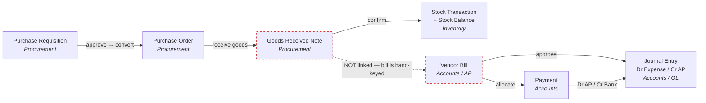
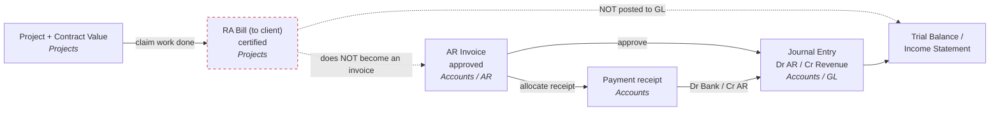
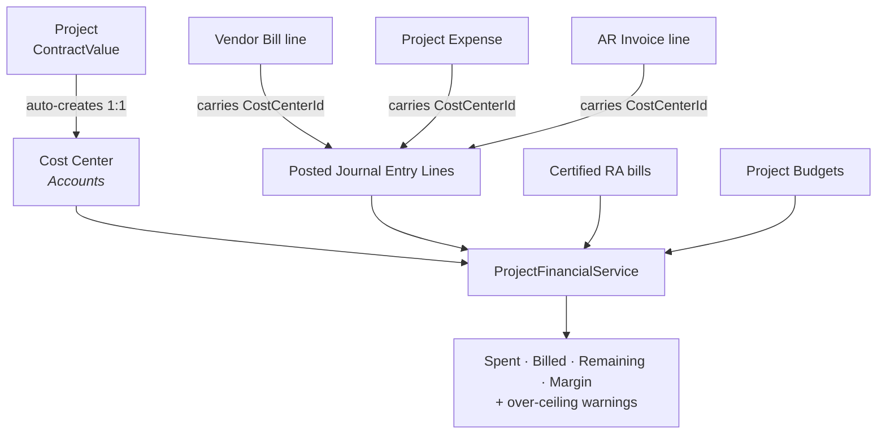

# BUSINESS_FLOW.md

How money moves through uOrgHub — the **procure-to-pay**, **order-to-cash**, and **project
costing** flows, and how each one lands in the general ledger.

This is a companion to `CODING_STANDARDS.md` (style, entity rules) and `CLAUDE.md`
(architecture). It documents *behaviour*, not conventions. Every claim cites a `file.cs:line`
so it can be checked against the code — and it deliberately marks the places where the chain is
**not** connected yet, drawn as dashed edges in the diagrams. Those are gaps in wiring, not bugs.

> Scope: the money spine only. HR (except payroll's GL gap), the Inventory catalogue, and the
> non-financial project lifecycle (BOQ, WBS, DPR, QA, safety, RFI) are out of scope here.

---

## 1. The general ledger is the hub

Every financial fact in the system is true only once it becomes a **journal entry** in the
Accounts module. A journal entry is balanced double-entry (`TotalDebit == TotalCredit`) and
counts toward reports only when its status is `Posted`
(`uOrgHub.Accounts/Models/Enums/JournalEntryStatus.cs`: `Draft, Posted, Cancelled`).

**Only five actions post to the ledger.** Everything else upstream — requisitions, purchase
orders, goods receipts, RA bills — is paperwork that does not touch the books until it funnels
into one of these:

| # | Trigger | Debit | Credit | Where |
|---|---------|-------|--------|-------|
| 1 | **Bill approved** (AP) | Expense (per line, carries `CostCenterId`) | Accounts Payable | `uOrgHub.Accounts/Features/AP/BillFeatures.cs:248-283` |
| 2 | **Invoice approved** (AR) | Accounts Receivable | Revenue (per line, carries `CostCenterId`) | `uOrgHub.Accounts/Features/AR/InvoiceFeatures.cs:248-278` |
| 3 | **Payment created** | Bank *or* AP (settlement) | AR *or* Bank | `uOrgHub.Accounts/Features/Payment/PaymentFeatures.cs:210-241` |
| 4 | **Project expense approved** | chosen debit account (carries the project cost center) | chosen credit account | `uOrgHub.Projects/Features/ProjectExpenses/Commands/ProjectExpenseCommands.cs:142-180` |
| 5 | **Manual journal / bank transaction** | as entered | as entered | `uOrgHub.Accounts/Services/JournalEntryService.cs`, `uOrgHub.Accounts/Features/Banking/BankingFeatures.cs` |

All five route through `IJournalEntryService` (`PostAsync` / `CancelAsync`), which is the single
choke point that moves account balances. Posting a bill or invoice stamps each expense/revenue
line with its **cost center**, and that stamp is what makes project costing possible (section 4).

---

## 2. Procure-to-pay (money out)

The path from "we need to buy something" to "the vendor is paid".

**Walk-through.** A **Purchase Requisition** (`PRStatus: Draft → Submitted → Approved → Rejected
→ Converted`) is approved and converted into a **Purchase Order** (`POStatus: Draft → Sent →
Confirmed → PartiallyReceived → FullyReceived → Cancelled`). When goods arrive, a **Goods
Received Note** (`GRNStatus: Draft → Confirmed`) is confirmed, which writes a `StockTransaction`
of type `GoodsReceived` and updates the `StockBalance` in Inventory
(`uOrgHub.Procurement/Features/GoodsReceivedNotes/Commands/GRNCommands.cs:218-257`).

Then the chain breaks (see [§5, break 1](#5-where-the-chain-breaks-today)): the **Vendor Bill**
is entered by hand in Accounts with no reference back to the PO or GRN. Approving the bill posts
**Dr Expense / Cr Accounts Payable** and stamps each line's cost center. Finally a **Payment**
settles the bill: allocating a payment raises `Bill.PaidAmount` and flips the bill to
`PartiallyPaid` / `Paid` (`PaymentFeatures.cs:143-162`), and the payment's own journal entry
posts **Dr AP / Cr Bank**.

---

## 3. Order-to-cash (money in)

Two independent lanes bring revenue in. They both end at a **Payment receipt**, but they never
meet before that.

**RA bill lane.** A project bills its client with **Running Account bills** against the contract
value (`RABillStatus: Draft → Submitted → UnderReview → Certified → Paid → Rejected`).
Certification recomputes the bill's net and its cumulative-to-date and warns if cumulative
billing crosses the contract value (`uOrgHub.Projects/Features/RABills/Commands/RABillCommands.cs`,
`CertifyRABillCommandHandler`). But a certified RA bill **never posts to the GL and never becomes
an AR invoice** — it lives only in `proj_ra_bills`.

**AR invoice lane.** An **Invoice** (`InvoiceStatus: Draft → Sent → PartiallyPaid → Paid →
Overdue → Cancelled → Void`) is the lane that actually books revenue: approving it posts **Dr AR
/ Cr Revenue**. A **Payment receipt** then settles it (**Dr Bank / Cr AR**), raising
`Invoice.PaidAmount` and flipping status (`PaymentFeatures.cs:143-162`).

So today, for client billing to reach the books, someone must raise an AR invoice separately from
the RA bill.

---

## 4. Project costing — the spine end to end

This is where procure-to-pay and order-to-cash meet a single project, and it is what the recent
`ProjectFinancialService` work made real.

Each project **auto-creates one cost center** at creation
(`uOrgHub.Projects/Features/Projects/Commands/ProjectCommands.cs:57-67`; `CostCenter.ProjectId`).
Because every GL-posting action (§1) stamps its expense/revenue lines with a cost center, a
project's spend is already sitting in the ledger — it just had to be read.

`ProjectFinancialService` (`uOrgHub.Projects/Services/`) derives the picture at read time so it
can never drift:

- **Spent** = posted journal-entry lines on the project's cost centers, **restricted to
  Expense accounts**. That restriction matters: a payment posts AP-against-Bank, so counting
  *every* cost-center line would charge a bill twice — once at approval, again at payment.
- **Billed** = certified + paid RA bills (RA bills aren't in the GL, so they're read directly).
- **Cost ceiling** = sum of project budgets (revised, else allocated), **falling back to the
  contract value** when no budget rows exist.
- **Margin** = billed − spent.

Overruns are **reported, never blocked**: approving a bill or certifying an RA bill past the
ceiling returns a warning that surfaces in the API response message, but the document still
saves. Exposed at `GET projects/{id}/financial-summary` and on the project detail page.

---

## 5. Where the chain breaks today

These are wiring gaps, not defects — each is a deliberate "not built yet", listed worst-first by
how much financial visibility it costs.

| # | Break | Evidence | Consequence |
|---|-------|----------|-------------|
| 1 | **Vendor bill is not linked to its PO or GRN.** `CreateBillDto` has no `POId`/`GRNId` | `uOrgHub.Accounts/DTOs/AP/APDtos.cs:48-59` | No three-way match (PO ↔ receipt ↔ bill); bills are hand-keyed and can silently disagree with what was ordered and received |
| 2 | **Goods receipt posts no accounting.** GRN moves stock only | no `JournalEntry` in `GRNCommands.cs` (`:218-257` writes stock, nothing to GL) | "Goods received not invoiced" is invisible to the books; inventory value and the ledger can diverge |
| 3 | **RA bills never reach the GL and never become AR invoices** | no `JournalEntry` or `Invoice` creation anywhere in `uOrgHub.Projects/Features/RABills/` | Certified client billing does not appear in the trial balance or income statement; revenue must be re-entered as an AR invoice by hand |
| 4 | **Payroll never posts to the GL** | no `new JournalEntry` anywhere in `uOrgHub.HR` | Salary expense and the payroll liability never book; labour cost is absent from both the P&L and project costing |
| 5 | **PO approval books no commitment** | no `JournalEntry` in `uOrgHub.Procurement/Features/PurchaseOrders/` | No commitment accounting — approved-but-unbilled spend isn't reflected against a project's ceiling |
| 6 | **Vendor and Client/Customer are duplicated across modules** | `Vendor.cs` exists in *both* `uOrgHub.Accounts` and `uOrgHub.Procurement`; `Client` (Projects) and `Customer` (Accounts) are separate with no FK (`uOrgHub.Projects/Models/Entities/Client.cs`) | The vendor you raise a PO to and the vendor you bill are different records; a project's client is not the AR customer you invoice |
| 7 | **Issuing stock to a project carries no cost** | `StockTransaction` has no `ProjectId`/`CostCenterId` (`uOrgHub.Inventory/Models/Entities/StockTransaction.cs`) | Consuming inventory into a project doesn't hit that project's cost |

**The natural next links**, in order: bill ← PO/GRN (break 1, unlocks three-way match); RA bill →
AR invoice → GL (break 3, unlocks revenue reporting); payroll → GL (break 4); unify Vendor and
Client/Customer (break 6, prerequisite for clean cross-module reporting).

---

## 6. Status vocabularies

The state machines the flows above traverse. All enums live under each module's `Models/Enums/`.

| Enum | Values | File |
|------|--------|------|
| `PRStatus` | Draft → Submitted → Approved → Rejected → Converted | `uOrgHub.Procurement/Models/Enums/ProcurementEnums.cs` |
| `RFQStatus` | Draft → Sent → Closed → Cancelled | `ProcurementEnums.cs` |
| `QuotationStatus` | Received → Evaluated → Accepted → Rejected | `ProcurementEnums.cs` |
| `POStatus` | Draft → Sent → Confirmed → PartiallyReceived → FullyReceived → Cancelled | `ProcurementEnums.cs` |
| `GRNStatus` | Draft → Confirmed → Cancelled | `ProcurementEnums.cs` |
| `BillStatus` | Draft → Received → PartiallyPaid → Paid → Overdue → Cancelled → Void | `uOrgHub.Accounts/Models/Enums/BillStatus.cs` |
| `InvoiceStatus` | Draft → Sent → PartiallyPaid → Paid → Overdue → Cancelled → Void | `uOrgHub.Accounts/Models/Enums/InvoiceStatus.cs` |
| `JournalEntryStatus` | Draft → Posted → Cancelled | `uOrgHub.Accounts/Models/Enums/JournalEntryStatus.cs` |
| `RABillStatus` | Draft → Submitted → UnderReview → Certified → Paid → Rejected | `uOrgHub.Projects/Models/Enums/RABillStatus.cs` |
| `ProjectStatus` | Inquiry → Planning → Active → OnHold → Completed → Cancelled → Tender → Handover | `uOrgHub.Projects/Models/Enums/ProjectStatus.cs` |

---

*Every reference above points at code as of the `feat/project-financial-control` branch. When a
flow changes, update the cited line and the matching diagram edge together.*
