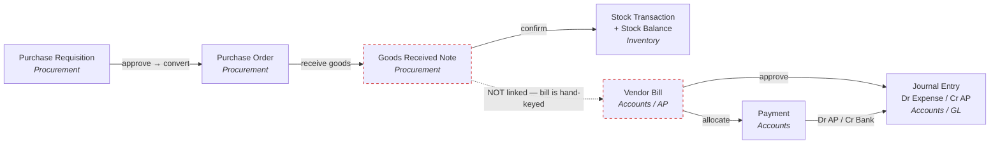
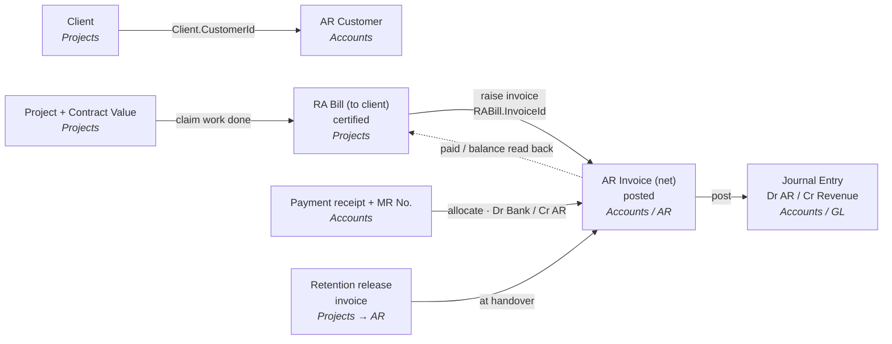
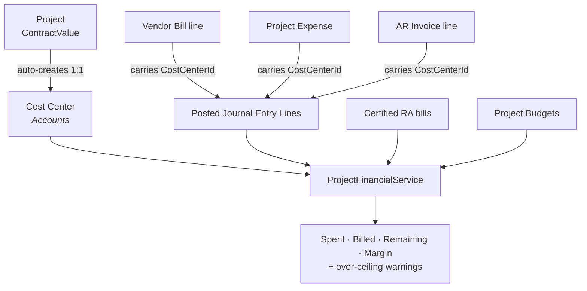

# BUSINESS_FLOW.md

How money moves through uOrgHub — the **procure-to-pay**, **order-to-cash**, and **project
costing** flows, and how each one lands in the general ledger.

This is a companion to `CODING_STANDARDS.md` (style, entity rules) and `CLAUDE.md`
(architecture). It documents *behaviour*, not conventions. Every claim cites a `file.cs:line`
so it can be checked against the code — and it deliberately marks the places where the chain is
**not** connected yet, drawn as dashed edges in the diagrams. Those are gaps in wiring, not bugs.

> Scope: the money spine only. HR (except payroll's GL gap), the Inventory catalogue, and the
> non-financial project lifecycle (BOQ, WBS, DPR, QA, safety, RFI) are out of scope here.

---

## 1. The general ledger is the hub

Every financial fact in the system is true only once it becomes a **journal entry** in the
Accounts module. A journal entry is balanced double-entry (`TotalDebit == TotalCredit`) and
counts toward reports only when its status is `Posted`
(`uOrgHub.Accounts/Models/Enums/JournalEntryStatus.cs`: `Draft, Posted, Cancelled`).

**Only seven actions post to the ledger.** Everything else upstream — requisitions, purchase
orders, goods receipts, RA bills — is paperwork that does not touch the books until it funnels
into one of these:

| # | Trigger | Debit | Credit | Where |
|---|---------|-------|--------|-------|
| 1 | **Bill approved** (AP) | Expense (per line, carries `CostCenterId`) | Accounts Payable | `uOrgHub.Accounts/Features/AP/BillFeatures.cs:248-283` |
| 2 | **Invoice approved** (AR) | Accounts Receivable | Revenue (per line, carries `CostCenterId`) | `uOrgHub.Accounts/Features/AR/InvoiceFeatures.cs:248-278` |
| 3 | **Payment created** | Bank *or* AP (settlement) | AR *or* Bank | `uOrgHub.Accounts/Features/Payment/PaymentFeatures.cs:210-241` |
| 4 | **Project expense approved** | chosen debit account (carries the project cost center) | chosen credit account | `uOrgHub.Projects/Features/ProjectExpenses/Commands/ProjectExpenseCommands.cs:142-180` |
| 5 | **Manual journal / bank transaction** | as entered | as entered | `uOrgHub.Accounts/Services/JournalEntryService.cs`, `uOrgHub.Accounts/Features/Banking/BankingFeatures.cs` |
| 6 | **Depreciation run posted** (monthly) | Depreciation Expense (per asset, carries the asset's `CostCenterId`) | Accumulated Depreciation (contra-asset) | `uOrgHub.Accounts/Features/FixedAssets/DepreciationRunFeatures.cs` |
| 7 | **Equipment hire run posted** (any date range) | Equipment Hire (per deployment, carries the **project's** cost center) | Internal Equipment Recovery (income) | `uOrgHub.Accounts/Features/FixedAssets/HireChargeRunFeatures.cs` |

All seven route through `IJournalEntryService` (`PostAsync` / `CancelAsync`), which is the single
choke point that moves account balances. Posting a bill or invoice stamps each expense/revenue
line with its **cost center**, and that stamp is what makes project costing possible (section 4).

---

## 2. Procure-to-pay (money out)

The path from "we need to buy something" to "the vendor is paid".

```mermaid
flowchart LR
    PR["Purchase Requisition<br/><i>Procurement</i>"]
    PO["Purchase Order<br/><i>Procurement</i>"]
    GRN["Goods Received Note<br/><i>Procurement</i>"]
    STK["Stock Transaction<br/>+ Stock Balance<br/><i>Inventory</i>"]
    BILL["Vendor Bill<br/><i>Accounts / AP</i>"]
    JE["Journal Entry<br/>Dr Expense / Cr AP<br/><i>Accounts / GL</i>"]
    PAY["Payment<br/><i>Accounts</i>"]

    PR -->|approve → convert| PO
    PO -->|receive goods| GRN
    GRN -->|confirm| STK
    GRN -.->|NOT linked — bill is hand-keyed| BILL
    BILL -->|approve| JE
    BILL -->|allocate| PAY
    PAY -->|Dr AP / Cr Bank| JE

    classDef gap stroke-dasharray:5 5,stroke:#c00;
    class GRN,BILL gap;
```

**Walk-through.** A **Purchase Requisition** (`PRStatus: Draft → Submitted → Approved → Rejected
→ Converted`) is approved and converted into a **Purchase Order** (`POStatus: Draft → Sent →
Confirmed → PartiallyReceived → FullyReceived → Cancelled`). When goods arrive, a **Goods
Received Note** (`GRNStatus: Draft → Confirmed`) is confirmed, which writes a `StockTransaction`
of type `GoodsReceived` and updates the `StockBalance` in Inventory
(`uOrgHub.Procurement/Features/GoodsReceivedNotes/Commands/GRNCommands.cs:218-257`).

Then the chain breaks (see [§5, break 1](#5-where-the-chain-breaks-today)): the **Vendor Bill**
is entered by hand in Accounts with no reference back to the PO or GRN. Approving the bill posts
**Dr Expense / Cr Accounts Payable** and stamps each line's cost center. Finally a **Payment**
settles the bill: allocating a payment raises `Bill.PaidAmount` and flips the bill to
`PartiallyPaid` / `Paid` (`PaymentFeatures.cs:143-162`), and the payment's own journal entry
posts **Dr AP / Cr Bank**.

**Capital purchases (machinery, vehicles, equipment).** An excavator is not stock: it is bought on
the same PR → PO → Bill chain, but the bill line goes to the asset category's balance-sheet
account (e.g. *Plant & Machinery*) instead of an expense, so approval posts **Dr Plant & Machinery /
Cr AP**. The item is then registered as a `FixedAsset` (`uOrgHub.Accounts/Models/Entities/FixedAsset.cs`)
linked to that bill — the register itself never posts the acquisition, so the cost is booked exactly
once. From then on the monthly depreciation run (§1 row 6) moves cost to expense. Runs must go month
by month; a run for a later month catches up skipped months per asset, and reversal goes
newest-first (it cancels the entry and restores each asset's accumulated depreciation).
**Machines on projects.** Deploying an asset to a project (`AssetDeployment`) records where it is and
how the project pays: an internal hire rate (per day, or per month prorated by day), running costs
only (fuel/operator/repairs booked as ordinary project expenses), or nothing. Hire reaches the books
through hire charge runs over any date range: each hire-rate deployment is charged for its days on
site inside the range, Dr Equipment Hire on the project's cost center / Cr Internal Equipment
Recovery. Company-wide the pair nets to zero; per project it is real cost, so it shows in
`ProjectFinancialService`'s Spent and trips the same over-ceiling warning as bills. Posted ranges
never overlap (no day charged twice), any run can be reversed, and a machine cannot be returned
before the last day already charged.
Not built yet: disposal (sale/scrap gain-loss), external rental to third parties, maintenance/usage
logs (and hourly hire rates that need them), and turning a GRN into an asset automatically.

---

## 3. Order-to-cash (money in)

A contract's client billing now runs as one chain from the project to the ledger and back.

```mermaid
flowchart LR
    CL["Client<br/><i>Projects</i>"]
    CU["AR Customer<br/><i>Accounts</i>"]
    PRJ["Project + Contract Value<br/><i>Projects</i>"]
    RA["RA Bill (to client)<br/>certified<br/><i>Projects</i>"]
    INV["AR Invoice (net)<br/>posted<br/><i>Accounts / AR</i>"]
    JE["Journal Entry<br/>Dr AR / Cr Revenue<br/><i>Accounts / GL</i>"]
    PAY["Payment receipt + MR No.<br/><i>Accounts</i>"]
    RET["Retention release<br/>invoice<br/><i>Projects → AR</i>"]

    CL -->|Client.CustomerId| CU
    PRJ -->|claim work done| RA
    RA -->|raise invoice<br/>RABill.InvoiceId| INV
    RET -->|at handover| INV
    INV -->|post| JE
    PAY -->|allocate · Dr Bank / Cr AR| INV
    INV -.->|paid / balance read back| RA
```

**Client ↔ customer.** A project `Client` links to its Accounts `Customer` (`Client.CustomerId`);
"Create AR customer" on the Clients page makes one from the client's own details
(`CreateCustomerFromClientCommand`). The two models stay separate but are entered once.

**RA bill → invoice.** A certified RA bill raises and posts one AR invoice for its **net** amount
(gross − deductions − retention) on the project's cost center (`RaiseRABillInvoiceCommand`,
`uOrgHub.Projects/Features/RABills/Commands/RABillInvoicing.cs`), reusing Accounts'
`CreateInvoiceCommand` + `PostInvoiceCommand` so the Dr AR / Cr Revenue posting lives in one place.
Retention held on the bills is invoiced later through a **retention release**
(`proj_retention_releases`, capped at what is still held).

**Receipts drive the bill.** Payments are allocated to the invoice as before (`Invoice.PaidAmount`,
`PartiallyPaid`/`Paid`). The RA bill's payment state (Unpaid · Partially paid · Paid) is *read* from
its invoice — Accounts never references Projects — and the manual "Mark Paid" is refused once a bill
is invoiced. `GetContractAccountQuery` gives the per-contract picture: contract value, certified,
remaining to bill, invoiced, received, outstanding, retention held.

**Money receipt.** Every payment received gets an **MR No.** from its own running series per
company, continuing the paper MR books (`MoneyReceiptSeries`; next number set on the Payments page).
The printed receipt follows the company's MR form (counterfoil + client copy).

`ProjectFinancialService` still reads "Billed" from the RA bills, not from the GL, so revenue is not
double-counted.

---

## 4. Project costing — the spine end to end

This is where procure-to-pay and order-to-cash meet a single project, and it is what the recent
`ProjectFinancialService` work made real.

```mermaid
flowchart TD
    PRJ["Project<br/>ContractValue"] -->|auto-creates 1:1| CC["Cost Center<br/><i>Accounts</i>"]

    BILL["Vendor Bill line"] -->|carries CostCenterId| JEL
    EXP["Project Expense"] -->|carries CostCenterId| JEL
    INVL["AR Invoice line"] -->|carries CostCenterId| JEL
    JEL["Posted Journal Entry Lines"]

    CC --> FIN
    JEL --> FIN["ProjectFinancialService"]
    RA["Certified RA bills"] --> FIN
    BUD["Project Budgets"] --> FIN

    FIN --> OUT["Spent · Billed · Remaining · Margin<br/>+ over-ceiling warnings"]
```

Each project **auto-creates one cost center** at creation
(`uOrgHub.Projects/Features/Projects/Commands/ProjectCommands.cs:57-67`; `CostCenter.ProjectId`).
Because every GL-posting action (§1) stamps its expense/revenue lines with a cost center, a
project's spend is already sitting in the ledger — it just had to be read.

`ProjectFinancialService` (`uOrgHub.Projects/Services/`) derives the picture at read time so it
can never drift:

- **Spent** = posted journal-entry lines on the project's cost centers, **restricted to
  Expense accounts**. That restriction matters: a payment posts AP-against-Bank, so counting
  *every* cost-center line would charge a bill twice — once at approval, again at payment.
- **Billed** = certified + paid RA bills (RA bills aren't in the GL, so they're read directly).
- **Cost ceiling** = sum of project budgets (revised, else allocated), **falling back to the
  contract value** when no budget rows exist.
- **Margin** = billed − spent.

Overruns are **reported, never blocked**: approving a bill or certifying an RA bill past the
ceiling returns a warning that surfaces in the API response message, but the document still
saves. Exposed at `GET projects/{id}/financial-summary` and on the project detail page.

---

## 5. Where the chain breaks today

These are wiring gaps, not defects — each is a deliberate "not built yet", listed worst-first by
how much financial visibility it costs.

| # | Break | Evidence | Consequence |
|---|-------|----------|-------------|
| 1 | **Vendor bill is not linked to its PO or GRN.** `CreateBillDto` has no `POId`/`GRNId` | `uOrgHub.Accounts/DTOs/AP/APDtos.cs:48-59` | No three-way match (PO ↔ receipt ↔ bill); bills are hand-keyed and can silently disagree with what was ordered and received |
| 2 | **Goods receipt posts no accounting.** GRN moves stock only | no `JournalEntry` in `GRNCommands.cs` (`:218-257` writes stock, nothing to GL) | "Goods received not invoiced" is invisible to the books; inventory value and the ledger can diverge |
| 3 | ~~**RA bills never reach the GL and never become AR invoices**~~ — **closed**: a certified RA bill raises a posted AR invoice for its net amount; retention via retention releases | `RABillInvoicing.cs` | — |
| 4 | **Payroll never posts to the GL** | no `new JournalEntry` anywhere in `uOrgHub.HR` | Salary expense and the payroll liability never book; labour cost is absent from both the P&L and project costing |
| 5 | **PO approval books no commitment** | no `JournalEntry` in `uOrgHub.Procurement/Features/PurchaseOrders/` | No commitment accounting — approved-but-unbilled spend isn't reflected against a project's ceiling |
| 6 | **Client/Customer are separate models** (Vendor unified) — *partly closed*: `Client.CustomerId` links a project client to its AR customer, and "Create AR customer" creates it from the client, so it is entered once | `uOrgHub.Projects/Models/Entities/Client.cs` | The two records still exist side by side; editing a client's address doesn't update the customer |
| 7 | **Issuing stock to a project carries no cost** | `StockTransaction` has no `ProjectId`/`CostCenterId` (`uOrgHub.Inventory/Models/Entities/StockTransaction.cs`) | Consuming inventory into a project doesn't hit that project's cost |
| 8 | **Sister-concern (multi-company) isolation is partial.** All of Accounts' (`Bill`, `Voucher`, `Invoice`, `Payment`, `Budget`, `BankAccount`, `JournalEntry`, `NumberingSequence`, `FiscalYear`, `CostCenter`), Procurement's (`PurchaseRequisition`, `RequestForQuotation`, `VendorQuotation`, `PurchaseOrder`, `GoodsReceivedNote`), Projects' (`Project`), and Inventory's (`Warehouse`, `StockBalance`, `StockTransaction`) anchors are company-scoped; only HR remains globally shared | `SISTER_CONCERN_PLAN.md` §1, §6 | A second `Company` can run fully separate Accounts books, procure-to-pay documents, projects, and stock levels today, but payroll and HR expense requests are still visible group-wide — not yet a fully separate sister concern. Phased rollout for the rest in `SISTER_CONCERN_PLAN.md` §6 |

**The natural next links**, in order: bill ← PO/GRN (break 1, unlocks three-way match); payroll → GL (break 4); fully merge
Client/Customer (remainder of break 6); finish
sister-concern isolation (break 8 — HR is the only module left, see `SISTER_CONCERN_PLAN.md` §6).

---

## 6. Status vocabularies

The state machines the flows above traverse. All enums live under each module's `Models/Enums/`.

| Enum | Values | File |
|------|--------|------|
| `PRStatus` | Draft → Submitted → Approved → Rejected → Converted | `uOrgHub.Procurement/Models/Enums/ProcurementEnums.cs` |
| `RFQStatus` | Draft → Sent → Closed → Cancelled | `ProcurementEnums.cs` |
| `QuotationStatus` | Received → Evaluated → Accepted → Rejected | `ProcurementEnums.cs` |
| `POStatus` | Draft → Sent → Confirmed → PartiallyReceived → FullyReceived → Cancelled | `ProcurementEnums.cs` |
| `GRNStatus` | Draft → Confirmed → Cancelled | `ProcurementEnums.cs` |
| `BillStatus` | Draft → Received → PartiallyPaid → Paid → Overdue → Cancelled → Void | `uOrgHub.Accounts/Models/Enums/BillStatus.cs` |
| `InvoiceStatus` | Draft → Sent → PartiallyPaid → Paid → Overdue → Cancelled → Void | `uOrgHub.Accounts/Models/Enums/InvoiceStatus.cs` |
| `JournalEntryStatus` | Draft → Posted → Cancelled | `uOrgHub.Accounts/Models/Enums/JournalEntryStatus.cs` |
| `RABillStatus` | Draft → Submitted → UnderReview → Certified → Paid → Rejected | `uOrgHub.Projects/Models/Enums/RABillStatus.cs` |
| `ProjectStatus` | Inquiry → Planning → Active → OnHold → Completed → Cancelled → Tender → Handover | `uOrgHub.Projects/Models/Enums/ProjectStatus.cs` |

---

*Every reference above points at code as of the `feat/project-financial-control` branch. When a
flow changes, update the cited line and the matching diagram edge together.*
